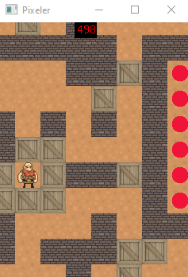
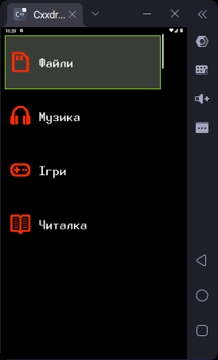

Завдяки цьому порту досягається двостороння сумісніть коду для GUI між мікроконтролером та ПК, що допоможе значно пришвидшити навчання, розробку та тестування GUI з використанням Pixeler-фреймворку.

В якості рендера вікна використовується SFML версії 3.0.2. 
Для збірки проєкту використовуйте компілятор для вашої ОС, що рекомендується розробником SFML за цим посиланням: [Download SFML 3.0.2](https://www.sfml-dev.org/download/sfml/3.0.2/).

 
